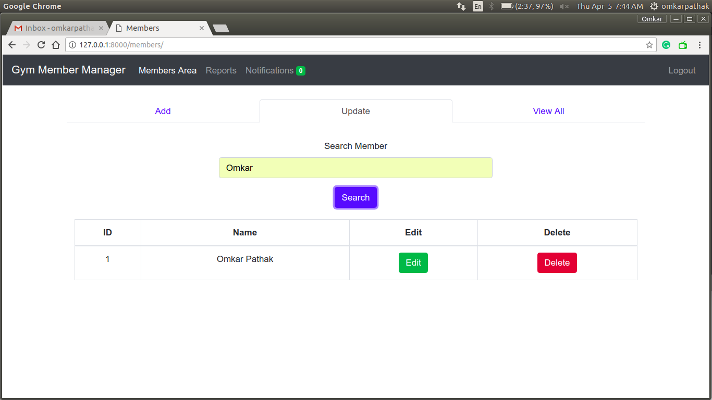
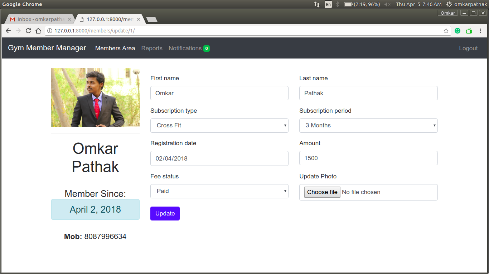
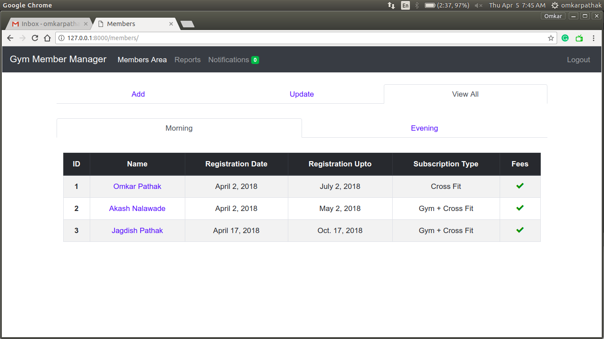
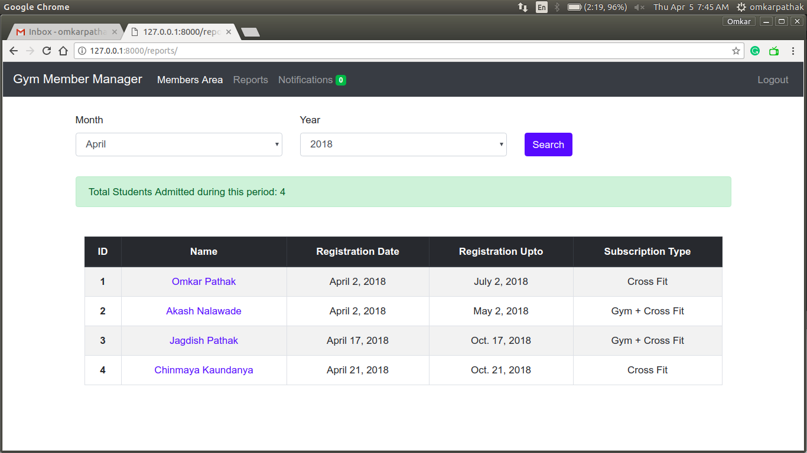

# Django-Gym-Member-Manager
A Gym Member Manager Web App using Django

A simple gym member manager to keep a track of all payments and members

## Features

- Easy to use (Even an amateur can use!)
- A simple GUI
- Faster load speeds (thanks to Django 2.0!)
- Reports for keeping track of payments and admissions

## Screenshots

- Easily add members

- Search and update the member information

- View all the admitted members and their fee status

- Reports Generation

